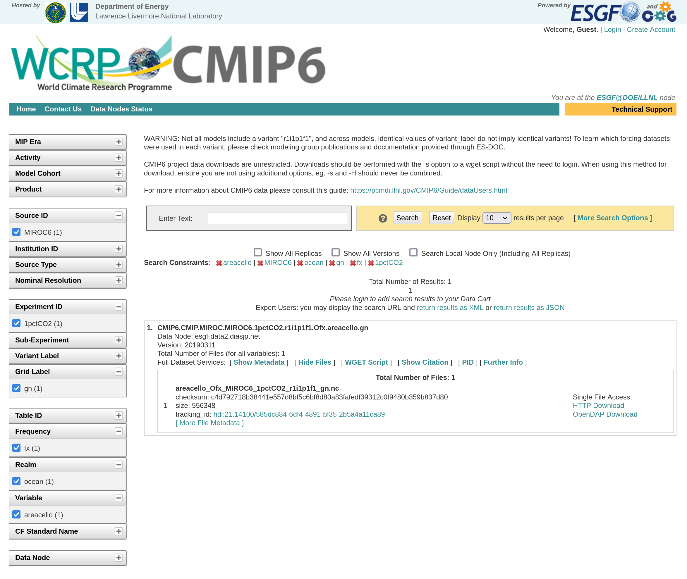

# cmip6download
This package is used to download CMIP6 data from ESGF nodes.
The data which has to be downloaded is specifed using a YAML file. Example YAML and configuration files for this module can be found in the `examples/` directory.

## Installation
1. Clone the source code from the [GitHub repository](https://github.com/maschwanden/cmip6download) and change directory into
    the cloned directory.
2. Install the module using `pip install .` (while you are in the src directory; there should be a `setup.py` file in it)
3. Copy the config file from `examples/config1.yaml` to `~/.config/cmip6download/config.yaml`.
4. Open the config file `~/.config/cmip6download/config.yaml` and set base_data_dir accordingly
(this is the directory where all the CMIP6 data will be downloaded into).

## Usage
After the module has been installed it can be called using
`python -m cmip6download OPTIONS QUERY_FILE`, where all available arguments for OPTIONS
are listed [below](#CONFIG_FILE) and QUERY_FILE is a path to a YAML file containing information
which data should be downloaded (see [here](#QUERY_FILE))

## QUERY_FILE
The query file is a YAML file specifying which data should be downloaded.
A query file contains "blocks" (see below), where one block is a collection
of filtering arguments which are then used to request data files from ESGF nodes.
Thus a block can be thought of as one call to the [CMIP6 data search interface](https://esgf-node.llnl.gov/search/cmip6/).
Each filtering argument given to a block filters narrows down the search results.

Here is an example query file ([`examples/query1.yaml`]):
```
#########
# Block 1
#########

- variable:
    - areacella
    - areacello
    - volcello
  frequency:
  experiment_id:
  grid_label:
  priority: 120

#########
# Block 2
#########

- variable:
    - no3
    - po4
    - co3
  frequency:
    - mon
    - yr
  experiment_id:
    - piControl
    - historical
    - ssp585
    - ssp126
  grid_label:
    - gn
  member_id:
    - r1i1p1f1
  priority: 80
```

As indicated by comments, this query file contains two "blocks" (each block is a list element).
One block contains one kind of data; there can be any number of "blocks" per query file.

In "Block 1" the variables "areacella", "areacello", and "volcello" are specified for downloading.
In this block no other filtering argument is provided. Thus this block will lead to the download
of all "areacella", "areacello", and "volcello" files of all scenarios, models, etc. The last
element of this block specifies the priority of this block. The priority is a arbitrary number
which specifies the relative importance of this block (and therefore the higher the number relative
to other priorities the sooner it will be processed). If no priority is given, a default value
of 100 is assumed.

In "Block 2" the variables "no3", "po4", and "co3" are specified for downloading.
In contrast to the block from above, now more filtering arguments are provided:
- frequency: Only monthly and yearly files
- experiment_id: Only files from the scenarios "piControl", "historical", "ssp585", and "ssp126"
- grid_label: Only files on the native grid (the grid used by the ESM itself)
- member_id: Only files from members with the ID "r1i1p1f1"
Finally, the priority is set to 80.

When cmip6download is called with this query file, first the grid areas ("areacella",
"areacello", and "volcello") and in a second step, the chemical variables will be downloaded).

### Check using the [CMIP6 data search interface](https://esgf-node.llnl.gov/search/cmip6/).
Now let's check whether cmip6_download finds the same data as a manual call to the
CMIP6 data search interface (hereafter called DSI).

We use the example query file 2 (query2.yaml from the examples directory):
```
#########
# Block 1
#########

- variable:
    - areacello
  frequency:  
    - mon
  experiment_id:
    - 1pctCO2
  grid_label:
    - gn
  realm:
    - ocean
  source_id:
    - MIROC6
```
First open the DSI and manually select all the filtering options specified in the query file.
This should then result in the following search result:

The search has resulted in a single file `areacello_Ofx_MIROC6_1pctCO2_r1i1p1f1_gn.nc`.
This file could now be directly download by clicking on the "HTTP Download" link.

Now we download this file using *cmip6_download*:
`python -m cmip6download REPOSITORY_DIR/examples/query2.yaml`
REPOSITORY_DIR is the directory where you stored the src code.

## CONFIG_FILE
The config file specifies some global options:
- cmip6restapi_url: The base URL for the CMIP6 search REST API
- base_data_dir: The directory where the CMIP6 data which is downloaded should be stored.
- max_download_attempts: Maximum number of download approaches until a file is assumed to
be not available.
- n_worker: Number of allowed parallel downloads. If set to 10, ten files will be downloaded
in parallel.

The only option in the config file which MUST BE set by the user is the `base_data_dir`.

## Options
All the options are given using the "flag syntax". Thus they are provided as follows:
```
python -m cmip6download --OPTION1 --OPTION2 QUERY_FILE
```
All options except `config_file` are boolean flags (thus no values has to be provided).
The `config_file` option has to be used as follows:
```
python -m cmip6download --config_file=/path/to/config/file QUERY_FILE
```

- verify: Specifies that all the files should be verified using MD5 checksums. If some files are outdated they are re-downloaded.
- noverify: Specifies that no files should be verified.
- gosearch: Specifies that the script should directly start with downloading the files (without asking the user for confirmation again).
- debug: Activates the debug mode, which writes out more information.

If the script should NOT ask the user for any confirmation (e.g. if the script should run automatically) the options `verify`/`noverify` AND `gosearch` have to be used. If they are not both specified the script will stop until a user confirmation is received. Thus either `--verify --gosearch` or `--noverify --gosearch` must be used.
